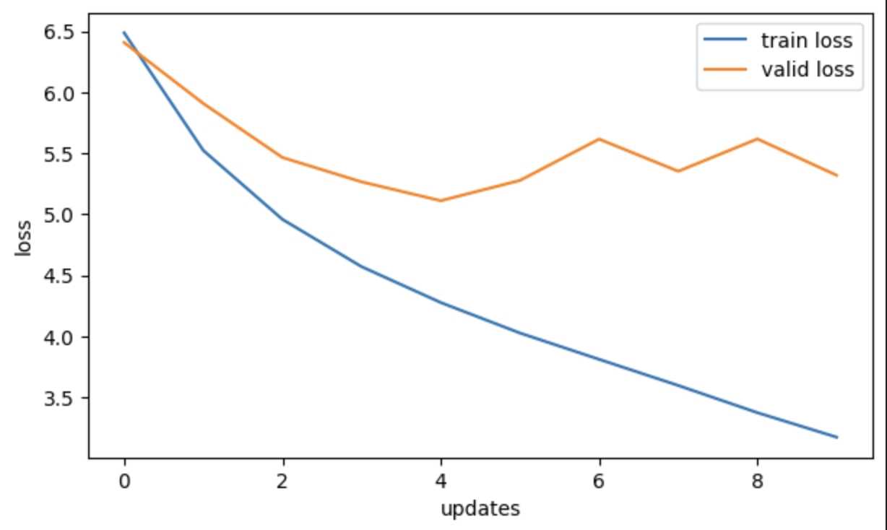
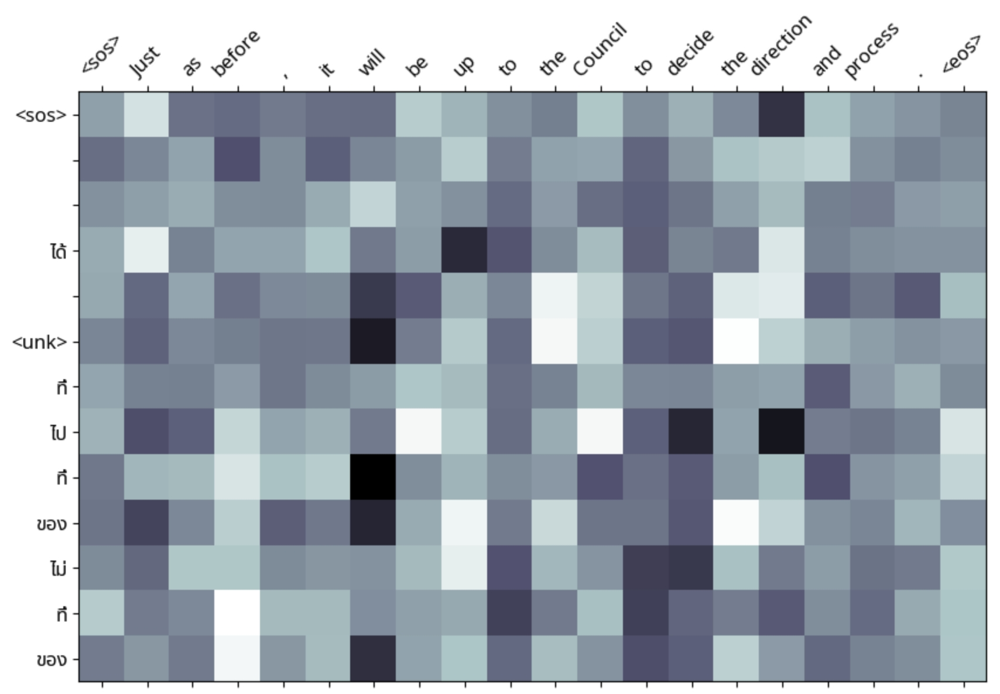
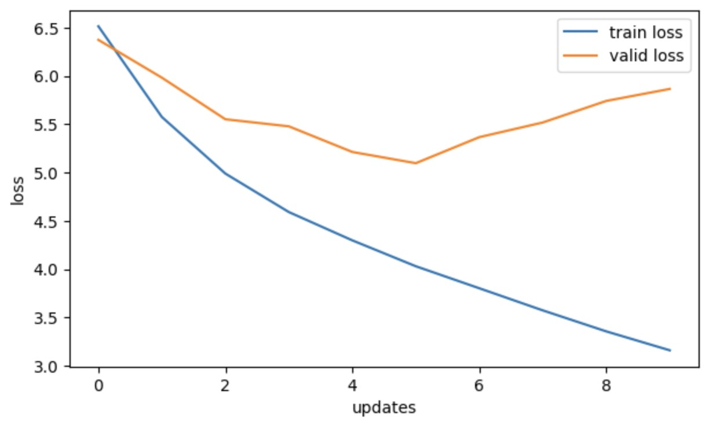
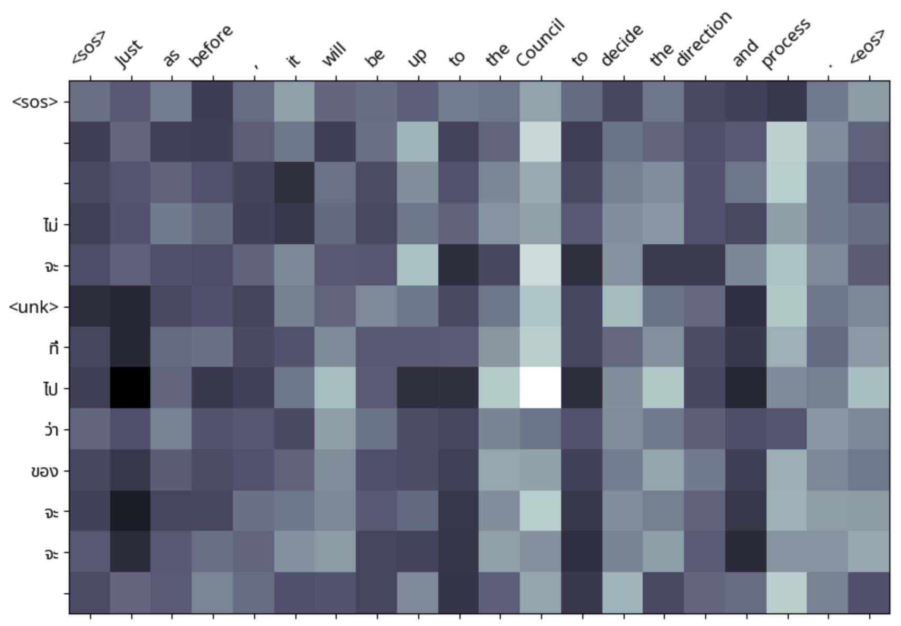
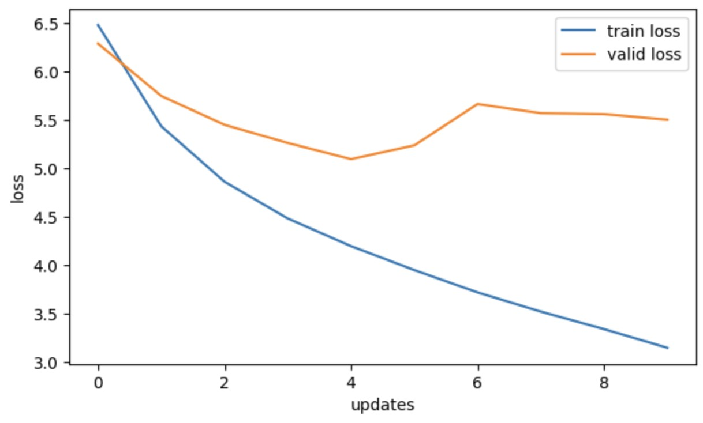
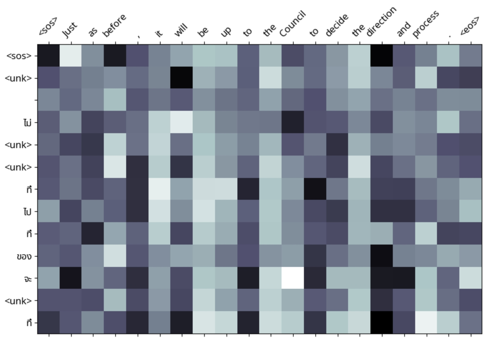
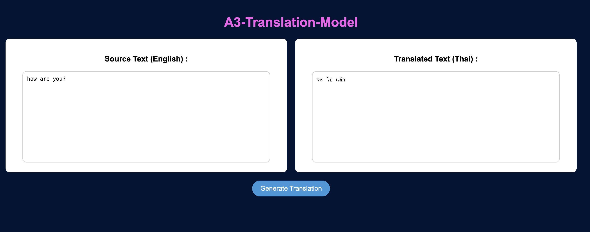

# A3-Make-Your-Own-Machine-Translation-Language
## st124738
## Sonakul kamnuanchai
## Objective
Translating between Thai language and English

## 1. Citation data source
- https://opus.nlpl.eu/results/en&th/corpus-result-table : SCB_MT_EN_TH and I have reduced size of dataset to 12563.

## 2. The process of preparing the dataset
- Step 1 : load dataset from citation data source that consists of two text files : en.txt , th.txt
- Step 2 : Using TorchData to load and process these files efficiently.
- Step 3 Text Normalization & Preprocessing : each sentence needs to be extracted, stripped of unnecessary whitespace, and structured properly.
- Step 4 Split data : take dataset into the train dataset and split it into train (70%), validation (20%), and test (10%) sets before tokenization.
- Step 5 Tokenization : Tokenization is a crucial step where we split sentences into words or subwords. For English, I use SpaCy and Thai doesn’t use spaces to separate words, so we need word segmentation. I use PyThaiNLP.
- Step 6 Text to integers (Numericalization) : To train the model, we need to convert words into numerical values.

## 3. Attention Comparison and Analysis with 10 epochs

| Attentions | Training Loss | Traning PPL | Validation Loss | Validation PPL |
|-------------------|-------------|---------------|---------------|--------------------|
| General Attention          | 3.175     | 23.938       | 5.320     | 204.449            |
| Multiplicative Attention    | 3.160     | 23.582       | 5.866       | 352.971            |
| Additive Attention             | 3.151     | 23.352       | 5.501      | 244.997            |

## Plot Loss Curve and heat map of General Attention

- General Attention : mechanism is working partially, unk appear once,and it lacks precise focus on specific words.

## Plot Loss Curve of Multiplicative Attention

- Multiplicative Attention: it's look sharper than General Attention , unk tokens appear once , and provides better word alignment than general attentions.

## Plot Loss Curve of Additive Attention

- Additive Attention fails to focus sharply on specific words and unk tokens appear frequently, showing the model's difficulty in mapping words properly.

## 4.Evaluation
| Attentions | BLEU Score (Accuracy) | compu-tational efficiency | Perplexity (PPL) |
|-------------------|-------------|---------------|---------------|
| General Attention          | 0.000     | 11m 53s       | 161.751     |
| Multiplicative Attention    | 0.000     | 12m 28s       | 156.725       |
| Additive Attention             | 0.000     | 31m 44s       | 157.903      |

## 5.Analysis and select the best attention

The Multiplicative Attention is the best choice because it has the lowest Perplexity (156.725), the heat map shows better word alignment, and it makes the most accurate translations. It also has a reasonable training time (12m 28s), much faster than the Additive Attention model (31m 44s), which takes too long but doesn't perform better.

## 6.How to run the application:
python app.py

## Video demo in web application

## Output sample in web application

